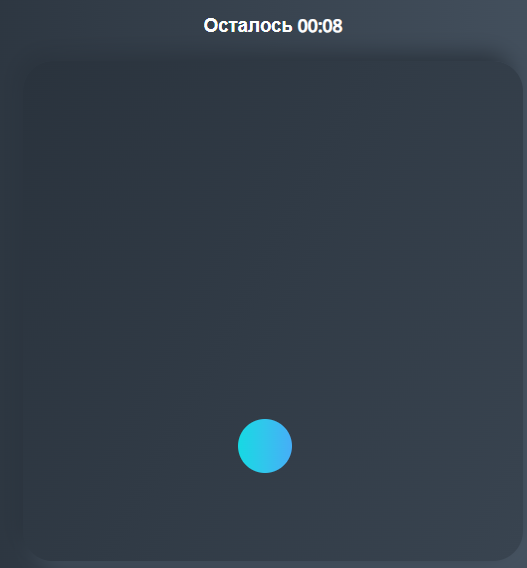

# Accuracy game 

- Hit the target to improve your aiming skills

Some of the code chunks 

```javascript
    const {width, height} = board.getBoundingClientRect()

    board.addEventListener('click', (e) => {
    if (e.target.classList.contains('circle')) {
        score++
        e.target.remove()
        createRandomCircle()
    }

    const getRandomNumber = ((min, max) => {
        return Math.round(Math.random() * (max - min) + min)
    })
})
```

